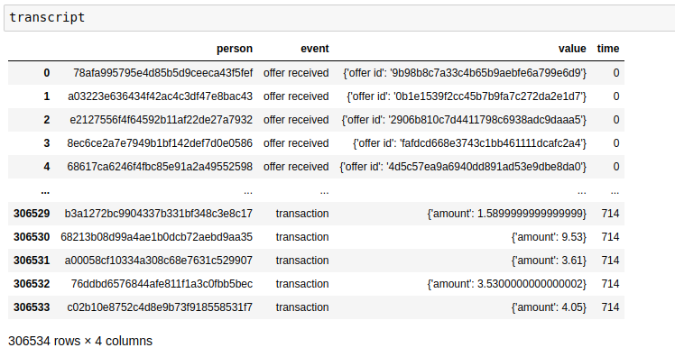
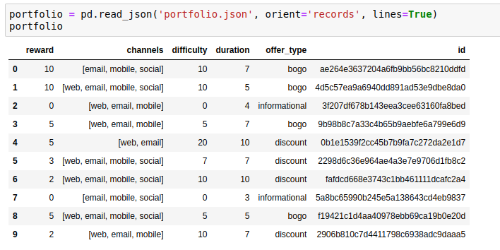
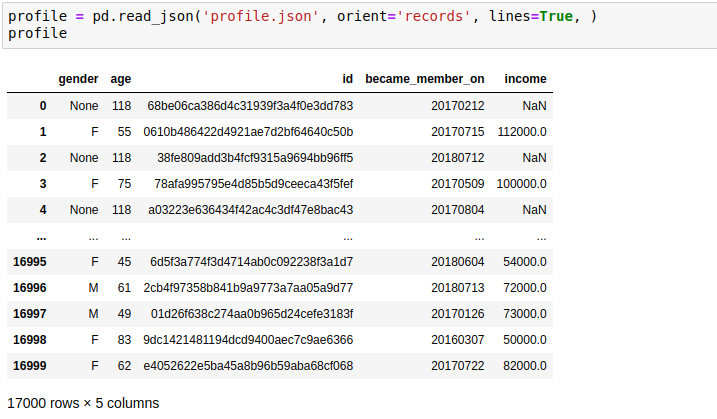
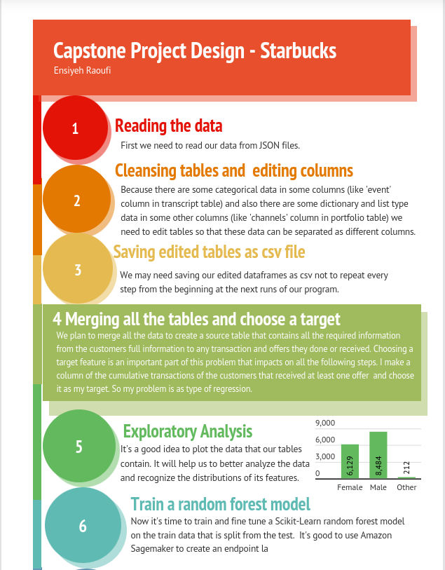
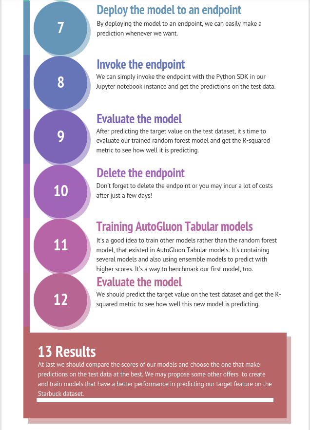

# Machine Learning Engineer Nanodegree
## Capstone Proposal
Ensiyeh Raoufi 
February 11st, 2022

## Proposal

I chose Starbucks capstone challenge, because the information gathered in this dataset was so interesting to me. I like to share Udacity introdution to this challenge, because it would be so helpful during solving any considerable problem on this dataset. Here it is:

#### Udacity Introduction and an Example

This data set contains simulated data that mimics customer behavior on the Starbucks rewards mobile app. Once every few days, Starbucks sends out an offer to users of the mobile app. An offer can be merely an advertisement for a drink or an actual offer such as a discount or BOGO (buy one get one free). Some users might not receive any offer during certain weeks. 

Not all users receive the same offer, and that is the challenge to solve with this data set.

Your task is to combine transaction, demographic and offer data to determine which demographic groups respond best to which offer type. This data set is a simplified version of the real Starbucks app because the underlying simulator only has one product whereas Starbucks actually sells dozens of products.

Every offer has a validity period before the offer expires. As an example, a BOGO offer might be valid for only 5 days. You'll see in the data set that informational offers have a validity period even though these ads are merely providing information about a product; for example, if an informational offer has 7 days of validity, you can assume the customer is feeling the influence of the offer for 7 days after receiving the advertisement.

You'll be given transactional data showing user purchases made on the app including the timestamp of purchase and the amount of money spent on a purchase. This transactional data also has a record for each offer that a user receives as well as a record for when a user actually views the offer. There are also records for when a user completes an offer. 

Keep in mind as well that someone using the app might make a purchase through the app without having received an offer or seen an offer. You'll also want to take into account that some demographic groups will make purchases even if they don't receive an offer. From a business perspective, if a customer is going to make a 10 dollar purchase without an offer anyway, you wouldn't want to send a buy 10 dollars get 2 dollars off offer. You'll want to try to assess what a certain demographic group will buy when not receiving any offers.

To give an example, a user could receive a discount offer buy 10 dollars get 2 off on Monday. The offer is valid for 10 days from receipt. If the customer accumulates at least 10 dollars in purchases during the validity period, the customer completes the offer.

However, there are a few things to watch out for in this data set. Customers do not opt into the offers that they receive; in other words, a user can receive an offer, never actually view the offer, and still complete the offer. For example, a user might receive the "buy 10 dollars get 2 dollars off offer", but the user never opens the offer during the 10 day validity period. The customer spends 15 dollars during those ten days. There will be an offer completion record in the data set; however, the customer was not influenced by the offer because the customer never viewed the offer.

#### My approach on this project

Observing 3 json files of the dataset, I understood that it needs a major cleansing to make it possible to work with. Based on the input files of the project we can obtain three tables of information about cutomers (their age, income, etc.), customer's transactions and offers transcript (offer status, transaction amount, etc.) and offers (offer type, offer spreading channels, etc.). I will completely explain about the dataset in the following parts, but here I want to describe the target that I'm going to predict in this project. My plan is to cleanse and sort all the data to make it possible to explore some information like histograms of all customer's genders, age distribution of all customers, female customer's offer rewards, distribution of all offer types, etc. Looking at the plots may help us to understand how a special type of feature is distributed along the dataset and this will give us hints about how we can perform some processes like filling the nan cells. For example if most of the cells in the "gender" column consist of "Male" and "Female" and not "None obvious gender", we can fill the NaN in this column by randomly choosing between male and female. After cleansing all the table and doing one hot encoding on all the necessary category features, we are going to merge all the tables and make an appropriate dataframe to work with. My goal on this project is to predict how well transaction amounts of people will increase or remain unchanged after receiving an offer. Actually I want to predict the cumulative transaction amount of people at the times they receive, view or complete an offer. So my problem is a regression one and I need a model to predict my target amount by the least mean squared or absolute error. I will use a model like Scikit_learn random forest on the Amazon Sagemaker, Then I will fine tune my Sagemaker estimator and at last I will create an endpoint and make predictions from it. I should evaluate the model on some metrics like R2 score and check how well my model is predicting on never seen data.
Then I should explain the results.

### Domain Background

This problem is in an economic problem of the companies who care about incresaing their sales through advertisments. It's an issue for recommender systems, because by gaining a good prediction result, we would understand how customers will increase their sales by receiving and viewing some special offers during a time period of some days. It's an interesting issue to follow, because we only need some information like age, income and membership date of our customers for predictions. Then we would ask our model that if we give an offer of the type x at a certain day of a month to our customers, how much they will increase their shopping in the following days of the month. I think it's an important issue for most of the companies around the world, because at last it's making money that matters for all of them!

### Problem Statement

As it's written in the project details of Udacity, there are a lot of problems that we can design about this dataset and that's the point that attracted me to choose the Starbucks as my capstone project. It is written as an advice by Udacity that:
"You could build a machine learning model that predicts how much someone will spend based on demographics and offer type. Or you could build a model that predicts whether or not someone will respond to an offer. Or, you don't need to build a machine learning model at all. You could develop a set of heuristics that determine what offer you should send to each customer (i.e., 75 percent of women customers who were 35 years old responded to offer A vs 40 percent from the same demographic to offer B, so send offer A).".

We can ask some more questions like how much different are the reactions of women and men to each special offer and do we need to train two separate models for each group (are the feature weights different for men and women?) Or is there a time period in month for females that they have maximum shopping? I'm asking this question because women tend to use more caffeine at their menstrual period and during this period even any informational offer would be motivating for buying a cup of Starbuck. This question can be asked for other goal groups like women in the age of menopause, or people around the world who is entering the autumn season. Because during these times people suffer from a deep depression and drinking a cup containing caffeine may make them feel better. 

My problem is one of the hundreds of question that one can ask about this dataset and here is the question I am asking:

** "Build a machine learning model that predicts how much more someone will spend based on demographics and offer type they will receive/view during the time.". **
 
For solving this problem I should first make a complete table from all other data tables that can work on it as the source data. This table must contain all the persons with all of their offers and transactions infromation. Then I should make a column that contains cumulative amount of transacrtions in this table. Because I'm investigating the increasing amount of customer transactions when they interface an offer, so I should remove the other rows that a customer does not receive/view/complete an offer. Then I should use a model like Random Forest Scikit_Learn to predict the customer's cumulative transactions. I can ignore columns that have a less importance by several training and getting feature importance each time. I should evaluate my model using a metric like R2 score that is a suitable metric for my regression problem.

### Datasets and Inputs

I have uploaded all the JSON files of the dataset as "data.zip" to this direstory. Here I mention the information that Udacity gave me first. Then I will explain my method for creating an input for my model training. Here is the Udacity description on this dataset:

#### Udacity dataset description

The data is contained in three files:

* portfolio.json - containing offer ids and meta data about each offer (duration, type, etc.)
* profile.json - demographic data for each customer
* transcript.json - records for transactions, offers received, offers viewed, and offers completed

Here is the schema and explanation of each variable in the files:

**portfolio.json**

* id (string) - offer id
* offer_type (string) - type of offer ie BOGO, discount, informational
* difficulty (int) - minimum required spend to complete an offer
* reward (int) - reward given for completing an offer
* duration (int) - time for offer to be open, in days
* channels (list of strings)

**profile.json**

* age (int) - age of the customer 
* became_member_on (int) - date when customer created an app account
* gender (str) - gender of the customer (note some entries contain 'O' for other rather than M or F)
* id (str) - customer id
* income (float) - customer's income

**transcript.json**

* event (str) - record description (ie transaction, offer received, offer viewed, etc.)
* person (str) - customer id
* time (int) - time in hours since start of test. The data begins at time t=0
* value - (dict of strings) - either an offer id or transaction amount depending on the record

#### My changes on data and creating a suitable input 

I read all the json files and made screenshots of all the raw data. Here you can their screenshots:

- reading transcript.json file:

By watching carefully to this table we can see that the "event" column consists of a categorical data with 'offer completed', 'offer received', 'offer viewed' and  'transaction' as its category names. So if we care about this feature to be one of our features for training the model or other future works on the dataset, we should generate a label encoding scheme for mapping each category to a numeric value. But because our category is not ordinal and for example if we assign the number 1 to the 'offer completed' then it has no preference to the number 4 that we assigned to the 'transaction' category, so we should do the one-hot encoding scheme that encodes or transforms this feature into 4 binary features which can only contain a value of 1 or 0. Also the "value" column contains some dictionary type data that its keys should be extracted and turn into some other new columns.

- reading portfolio.json file:

For this table we should also do the one-hot encoding on the "channels" and "offer_type" columns. We should also notice that the data on the "channels" column is of list type.

- reading profile.json file:

In this table we should be careful about NaN cells and choose a strategy for filling or removing the rows that contain NaN. I prefer to fill the NaN cells of a column with the help of the other cells of the column. For the gender column I prefer to fill the NaN cells with a random choose of "F" or "M". We can ignore the Other genders that mentiond by "O" because of their minority in the dataset. I also prefer to fill the NaN cells of the "income" column with the average of the column. We should change the cells that are filled with 118 on the "age" column because they are representing the NaN cells. For this column I also choose the average amount of the cells that are not 118, to fill these cells.

### Solution Statement

The solution to my question would be found with building a machine learning model that predicts the cumulative transactions of persons who received at least one offer at the times of they receive, view or complete an offer (just 5 persons of 17000 does not received any offers). This is a regression problem and it's enough to create a model that predicts my target (cumulative transactions) with the minimum errors. As an early plan, I can use random forest model of the Scikit_Learn library to train my data. I can use Amazon Sagemaker Estimator to do a training job. I should fine tune the estimator to find the best hyperparameters before the final training. We know that the hyperparameters in this model except for the "features" and "target", only include "the number of random records from the dataset" and "the number of trees in the algorithm". So after fine tuning and finding the best model, we should do a training job using a Sagemaker Sklearn Estimator. Then we should deploy our model to an endpoint and get the predictions on the test dataset by invoking the endpoint. We should evaluate our model using some appropriate metrics for a regression problem. We can use the R2 score that shows the performance of our model well. We should delete the endpoint after use to avoid incuring costs. 

### Benchmark Model

Because this problem is designed by myself, there's no definite source for benchmarking my model. However if my problem was a Kaggle challenge, I could submit my results and give back a score. But there's some online platforms like "Google’s Vertex AI" that one can upload their csv files and give back the prediction metrics. Unfortunately because these kind of sites incur me costs, I can't use them. But I can try a different training like Autogluon Tabular predictor to compare the results with the first trained model on my dataset. We know that this predictor gives us the best model from its various models (that contains Sklearn random forest), and at the end we can compare the R2 score of both training jobs and choose what is better and more convenient.

### Evaluation Metrics

I use the R2 (R-Squared) score which is the coefficient of determination. The calculation of R-squared requires several steps. This includes taking the data points (observations) of dependent and independent variables and finding the line of best fit, (here) from a regression model. From there you would calculate predicted values, subtract actual values and square the results. This yields a list of errors squared, which is then summed and equals the unexplained variance. In finance, an R-Squared above 0.7 would generally be seen as showing a high level of correlation, whereas a measure below 0.4 would show a low correlation [[1]](#1). Also we may use the absolute/mean-squared errors that are good metrics to show how far our predictions are from our real data target. 

### Project Design

I summerized my project design in a graphical image. I've designed it using Prezi website and here is the address to my poster:

https://prezi.com/i/ghuo2ba_zt-q/

I also have prepared the screenshots of my designed poster that you can see below. 

 
-----------

## References
<a id="1">[1]</a> 
1. https://www.investopedia.com/terms/r/r-squared.asp#:~:text=In%20other%20fields%2C%20the%20standards,would%20show%20a%20low%20correlation.
